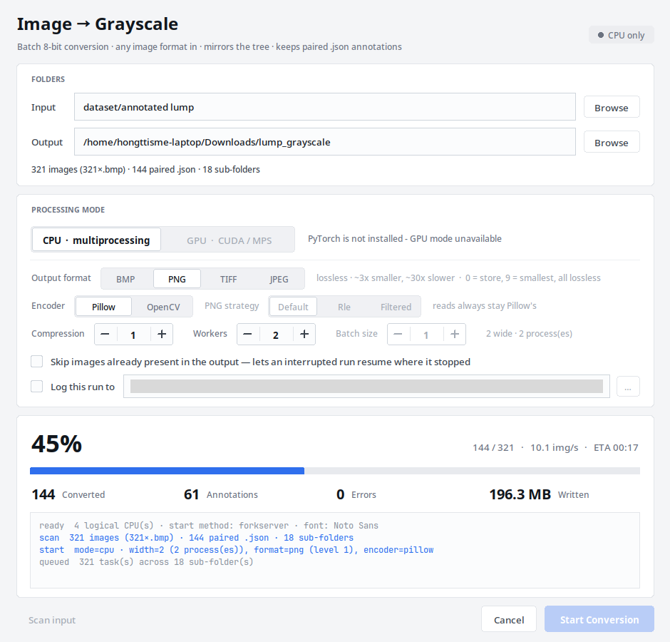

# rgb2gray — batch image → 8-bit grayscale

A desktop app that walks a folder of images, converts every one to **8-bit
single-channel grayscale** at the original resolution, mirrors the folder tree
exactly, and carries each image's paired `.json` annotation along with it.



```
rgb2gray/
├── pyproject.toml        # packaging + dependencies (the single source of truth)
├── src/rgb2gray/
│   ├── app.py            # Tkinter GUI (entry point)
│   ├── ui_kit.py         # flat widget set drawn on canvases
│   ├── gray_core.py      # engine: scan, mirror, CPU pool, GPU batch pipeline
│   ├── selftest.py       # correctness checks
│   └── __main__.py       # so `python -m rgb2gray` works too
├── README.md
└── REPORT.md             # why GPU mode is slower than CPU mode
```

---

## 1. Install

```bash
sudo apt install python3-tk        # Debian/Ubuntu only -- see below
uv pip install "git+https://github.com/hong0724/rgb2gray.git"

rgb2gray                           # or: python -m rgb2gray
```

**`tkinter` is the one thing pip cannot install.** It ships with CPython but is
not a PyPI package, so on Debian/Ubuntu it comes from `python3-tk`. Everything
else — Pillow, NumPy and OpenCV — comes down with the install above; both
encoders are there from the first run, including the PNG `rle` path that is the
4.6× smaller row in the format table below.

Because this is a GUI tool, an isolated install is tidier than dropping it into
a shared environment; the command still lands on `$PATH`:

```bash
uv tool install "git+https://github.com/hong0724/rgb2gray.git"
# or:  pipx install "git+https://github.com/hong0724/rgb2gray.git"
```

To pin a revision, put it on the URL: `...rgb2gray.git@v1.0`.

**Upgrading.** A git URL carries no version to compare against, so a plain
re-install is a no-op once it is already installed. Force it:

```bash
uv pip install --force-reinstall --no-deps "git+https://github.com/hong0724/rgb2gray.git"
```

**One optional extra**, `gpu`, for PyTorch — imported lazily, and the app runs
with GPU mode greyed out when it is absent. Read the wheel note below before
using it, because on Linux it installs the CPU-only build:

```bash
uv pip install "rgb2gray[gpu] @ git+https://github.com/hong0724/rgb2gray.git"
```

**Working on the code instead:**

```bash
git clone https://github.com/hong0724/rgb2gray.git
uv pip install -e rgb2gray        # edits take effect immediately
rgb2gray-selftest                 # 107 correctness checks
```

### GPU setup

`uv pip install torch` — and so `rgb2gray[gpu]` — gives the **CPU-only** wheel on
Linux, and GPU mode will say so. Install a matching CUDA wheel instead:

| Hardware | Command |
|---|---|
| NVIDIA, CUDA 12.8 (Blackwell / RTX 50xx, `sm_120`) | `uv pip install torch --index-url https://download.pytorch.org/whl/cu128` |
| NVIDIA, CUDA 12.1 | `uv pip install torch --index-url https://download.pytorch.org/whl/cu121` |
| Apple Silicon (MPS) | `uv pip install torch` |


---

## 2. What it does

**Input** — every image under the chosen folder, found recursively and
identified **by content, not by extension**: a PNG saved as `photo.bmp` is
handled as a PNG. BMP, PNG, JPEG, TIFF, WebP, GIF, PPM/PGM and TGA are all
accepted, and a folder may mix them freely. Files that are not images are
counted and reported, never silently skipped.

**Output** — one format for the whole run:

Sizes and times below are the whole pipeline — read, decode, luma, encode,
write.

| Format | Lossless | Output | vs BMP | Run time | vs BMP |
|---|---|---|---|---|---|
| **BMP** (default) | ✓ | 784 MB | 1.0× | 0.38 s | 1.0× |
| **PNG** (OpenCV, `rle`) | ✓ | **169 MB** | **4.6× smaller** | 1.41 s | 3.7× |
| **TIFF** (OpenCV, LZW) | ✓ | 207 MB | 3.8× smaller | 1.00 s | 2.6× |
| **JPEG** (q95) | ✗ **lossy** | 71 MB | 11.1× smaller | 0.47 s | 1.2× |

The trade-off is much milder than an encode-cost table suggests: PNG's encoder
is ~30× BMP's, but reading and decoding the frame do not change, so end to end
it is under 4×. The UI labels JPEG as lossy — its artefacts are on the same
scale as the smallest defects in this dataset, and past q97 it is no longer even
small: q98 is 117 MB and q99 is 159 MB against **lossless** PNG's 169 MB.

**Same-name sources** — one output format for many input formats means two
sources can want the same destination: `photo.jpg` and `photo.png` both become
`photo.bmp`. Only one file can exist there, so only one is converted: the first
in sorted order takes the name and the rest are **dropped and reported** — in the
scan line, in the log, and in the run record. Nothing is renamed, and the counts
always match the files on disk.

First rather than last is deliberate: adding a new `photo.png` beside an
existing `photo.bmp` then leaves the existing output alone. Before this rule,
*which* source survived depended on which worker finished first — measured, that
varied run to run and between modes.

**Annotations** — a `.json` next to `foo.bmp` and named `foo.json` travels to the
same relative location.


### Controls

| Control | Notes |
|---|---|
| **Output format** | BMP / PNG / TIFF / JPEG, with the cost shown beside it |
| **Compression** | PNG level 0–9 (default 1) or JPEG quality 1–100 (default 95). Disabled for BMP and TIFF, and for PNG under `rle`, where levels 1–9 are identical (a 0 there is lifted to 1 — see below) |
| **Encoder** | **Pillow** (default) or **OpenCV**, which alone can write PNG's `rle` — see below. Installed for you; the control greys out only if OpenCV is later removed |
| **PNG strategy** | OpenCV + PNG only: `default` / `rle` *(default)* / `filtered` |
| **Workers** | **Pipeline width — the same unit in both modes.** Defaults to one per *physical* core, for every format. Worth raising for PNG and TIFF — see below. **1 runs serially, with no pool and no threads** |
| **Batch size** (GPU mode) | Defaults to **1**; larger measured monotonically worse |
| **Skip images already present** | Resume an interrupted run |
| **Log this run** | Appends one CSV row per run — see below |

**One number, two costs.** Both modes default to the same width, so a CPU run
and a GPU run of the same folder differ in one thing. What differs is how many
OS workers that width costs, because the modes have a different number of stages:

| Width *N* | CPU mode | GPU mode |
|---|---|---|
| what a stage is | one process reads, converts and writes a whole image | the conversion moved to the device, leaving two CPU-side stages |
| what *N* buys | *N* processes | *N* decoders **+** *N* encoders = **2 *N* threads** |
| on an 8-core box | 8 processes | 16 threads |

So GPU mode really does run twice the threads, and that is not a different
setting — it is the same 8-wide pipeline with twice as many stages to staff. The
hint beside the stepper spells it out live ("8 wide — 8 decode + 8 encode = 16
threads"); the log records `workers` (the width) and `os_workers` (its cost).

The right width depends on the format, and the two answers are far apart.
Swept 1–16 over the whole 1661-frame reference dataset on an 8-core/16-thread
box:

| output | width 1 | width 8 | width 16 | 1 → 16 |
|---|---|---|---|---|
| BMP (Pillow) | 134.9 | **376.6** | 370.4 | 2.79× |
| JPEG q95 (Pillow) | 89.5 | 363.3 | **416.4** | 4.65× |
| TIFF (OpenCV, LZW) | 28.7 | 170.5 | **246.7** | 8.60× |
| PNG (OpenCV, `rle`) | 16.7 | 114.9 | **160.4** | 9.60× |


### Compression levels

**Every PNG level is lossless, including 0** — `compress_level` only decides how
hard zlib searches; the filter-plus-deflate pipeline is reversible at every
setting. 

| PNG level | Pillow | OpenCV `default` | OpenCV `rle` |
|---|---|---|---|
| 0 | 785 MB / 1.16 s | 786 MB / 1.08 s | 786 MB / 1.04 s |
| **1** *(default)* | 236 MB / 1.72 s | 226 MB / 1.55 s | **169 MB / 1.41 s** |
| 4 | 198 MB / 2.67 s | 203 MB / 1.98 s | 169 MB / 1.43 s |
| 6 *(Pillow's default)* | 195 MB / 6.60 s | 191 MB / 5.97 s | 169 MB / 1.42 s |
| 9 | 184 MB / 49.06 s | 180 MB / 54.40 s | 169 MB / 1.41 s |


**BMP and TIFF have no level.** BMP stores raw pixels; Pillow's TIFF writer
accepts `compress_level` and ignores it.

JPEG's control is `quality`, and it is not a lossless ladder: measured against
the lossless output of the same frames, even q=100 differs by up to **2** grey
levels (PSNR 59.4 dB).

### Encoders

Two encoders are selectable, for the same reason GPU mode exists: so a run can
be measured against another rather than argued about. **Only the write side
switches** — reading and format sniffing are always Pillow's, because OpenCV
has no API that reports what a file actually was and returns `None` instead of
raising on one it cannot read, which would cost the app its detect-by-content
behaviour and its error messages. Measured, keeping Pillow on the read side
costs 4 % (108 ms against 104 ms for an all-OpenCV path).

| PNG setting | output | run |
|---|---:|---:|
| Pillow, level 1 | 236 MB | 1.72 s |
| Pillow, level 9 | 184 MB | 49.06 s |
| OpenCV | 226 MB | 1.55 s |
| OpenCV rle | **169 MB** | **1.41 s** |

OpenCV rle 28 % smaller and 1.22× faster than Pillow's level 1; 8 % smaller than Pillow's
level 9 for 1/35th of its time. 

**Everywhere except PNG, Pillow is simply faster** — which is why it stays the
default everywhere.

| | Pillow | OpenCV |
|---|---|---|
| BMP | **784 MB / 0.38 s** | 784 MB / 0.57 s |
| TIFF (LZW) | 295 MB / 1.11 s | **207 MB / 1.00 s** |
| JPEG q95 | **71 MB / 0.47 s** | 71 MB / 0.58 s |


### Run log

Ticking *Log this run* appends one row to a `.csv`, writing the header only when
the file is new. 49 columns in seven groups: when and where, the settings, the
result, the timing, what the scan found but did not convert, the machine, and
what failed. The header names them all; the ones worth knowing in advance:

* `run_id` identifies the run — `20260908T105224-210c`, sortable, and unique
  even for two runs that start in the same second. It is what joins this file
  to the failure log below.
* `workers` is the pipeline width, `os_workers` what it cost.
* `estimated_s` is the duration predicted once 100 images are done, and
  `estimate_time_error_pct` the signed error against it — a shorter run leaves
  both empty, deliberately.
* `source_formats` is a histogram cell, `BMP:40 PNG:3`, taken from file content.
* `compression_level` is empty for BMP and TIFF, which have no control.
* `encoder` and `png_strategy` say who wrote the file — without them a batch of
  comparison runs cannot be attributed. 
* The `gpu*` columns come from `nvidia-smi` and are empty without it.
* `error_kinds` is a histogram cell like `source_formats` —
  `decode:OSError:38 unreadable:2` — counted over **every** failure, never
  truncated. `first_error` is one example spelled out in full.
* `failures_logged` is how many failures reached the failure log. It equals
  `failed` unless the run blew past the 10,000-file detail cap, which is the
  only way a short list can mean an incomplete one.

### Failure log

`failed` tells you how many; it cannot tell you *which*, because the run log is
one row per run and a run has 0..n failures. So when — and only when — a run
fails, a sibling file appears next to the run log: `runs.csv` gets
`runs_failures.csv`, one row per failed file.

```csv
run_id,timestamp,src,error_kind,error
20260908T105224-210c,2026-09-08T10:52:24+0800,/data/in/corrupt.bmp,unreadable,not a readable image (content does not match any known format)
20260908T105224-210c,2026-09-08T10:52:24+0800,/data/in/sub/zero.bmp,unreadable,not a readable image (content does not match any known format)
```

That is a work list: the paths to re-run, or to drop from the dataset. Join it
back to the run log on `run_id` for the settings the failures happened under.
A clean history never grows the file at all.


---

## 3. Self-test

```bash
rgb2gray-selftest           # exit 0 = everything passed
# equivalently, without installing:  python -m rgb2gray.selftest
```

Builds its own fixture — mixed formats, a PNG deliberately named `.bmp`, two
sources fighting for one output name, an empty directory, an unpaired `.json`, a
non-image file — runs the engine over it in every output format, and asserts
every invariant this README claims. Each check prints its own name, so the run
is its own list of what is guaranteed.

The project's only automated test. Run it after touching `gray_core.py`.

---

## 4. How it works

**CPU mode** — `multiprocessing.Pool`, one whole file per task. Each worker does
read → decode → luma → encode → write on its own; `Image.open(...).convert("L")`
fuses decode and luma in one C loop and never builds an array. This is the fast
path.

**GPU mode** — reader threads → a batching device thread → writer threads, joined
by bounded queues so memory stays flat. Frames are bucketed by resolution before
batching, and transfers use pinned memory. It is kept as a **comparison mode**:
on the reference hardware it never beat CPU mode, because the luma arithmetic is
a small share of the work and staging batches adds host memory traffic on the
resource that is already the constraint. See REPORT.md.

**Crash safety** — every image and annotation is written to a hidden sibling file
and then `os.replace`-d into place, so a cancelled run cannot leave a
half-written file that later looks like a valid conversion. Leftover staging
files are swept after an aborted or partly failed run.


